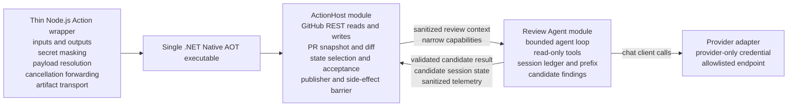

# Agent Runtime Architecture Rebaseline

Status: selected target architecture; implementation pending.

Decision date: 2026-07-24.

Last revised: 2026-07-25.

This document records the architecture rebaseline for the project-owned code review agent. It supersedes the earlier long-term assumption that TypeScript remains the business-capable GitHub Action host and C# remains behind a broad language-neutral protocol. Existing M1-M4 documents continue to describe the implementation currently on `main` until migration work removes or replaces those surfaces.

The breaking-reset governance gate and post-merge transition are tracked by [issue #75](https://github.com/SolusQuest/agentic-pr-review/issues/75). The coordinated documentation PR references that issue without closing it; the issue remains open until the authorized GitHub metadata transition and R1/R2 parent creation are complete.

## Decision Summary

### Decision

The project will converge on a C#-owned product architecture:

1. A thin Node.js GitHub Action wrapper handles only Action-runtime integration that is materially simpler or safer through the official JavaScript toolkit.
2. One Native AOT .NET executable contains a deterministic `ActionHost`, an in-process review `Agent`, and provider adapters behind narrow capability interfaces.
3. `ActionHost` owns GitHub reads and writes, state selection and acceptance, deterministic publishing, and the final side-effect barrier.
4. The `Agent` owns the bounded loop, read-only repository tools, canonical session state, and proposed findings, but it does not receive host secrets, GitHub clients, ambient configuration, or arbitrary service resolution.
5. The current security boundary is model-visible data and model-callable capability flow, not a mandatory Host/Agent process split. A worker process remains a future isolation option when evidence justifies its cost.
6. The first supported live review profile uses a small, review-specific tool set with provider thinking enabled. Provider-returned continuation artifacts, including reasoning content when covered by the provider contract, are preserved when required or recommended for exact tool-loop or cross-run continuation.
7. The durable model has two layers: project-owned logical message/tool/outcome records and a separate provider-scoped continuation envelope. Opaque provider payloads remain value-exact, while structured provider items preserve validated fields, array order, and adapter-required placement; this does not prevent canonical project-owned logical records.
8. Restricted continuation state is never repository-visible plaintext. A transport that cannot keep readable reasoning, bounded tool results, and provider continuation material confidential must use workflow-authorized encryption or must not persist the readable payload.
9. Encrypted continuation state provides authenticated confidentiality or equivalent integrity protection bound to its format, Host-authoritative identity, provider/adapter scope, session, and required generation/provenance. Altered, substituted, stale, or undecryptable state is rejected before Agent/provider admission.
10. R2 decides whether a pinned `Microsoft.Extensions.AI.Abstractions` dependency or project-minimal exchange types provide the smaller verified Native AOT surface. Either choice leaves the agent loop, durable session model, provider request materialization, budgets, checkpoints, and final result validation project-owned.
11. The unshipped Claude Code CLI implementation will be removed from the new development head. The existing immutable `v0.1.0` tag remains the historical legacy pin; the project will not publish later unshipped legacy work merely to create a final snapshot.
12. Versioning is retained only for independently released artifacts and durable cross-run formats. Cache-relevant policy, prompt, tool, and provider configuration use canonical content identities instead of parallel manual version and id families.

### Recommended Option

Implement a vertical slice before completing the TypeScript-to-C# host migration:

1. remove the Claude Code CLI and legacy backend selection from the new head;
2. prove the C# agent loop, tool execution, session round-trip, Native AOT, and model-visible secret boundary inside the existing C# executable;
3. use the existing deterministic host/publisher behavior temporarily where it shortens the path to the vertical slice;
4. migrate stable GitHub host responsibilities into `.NET ActionHost`;
5. delete duplicate TypeScript business logic and contract implementations;
6. resume broad cost-evaluation and release-graduation work only after real resumed agent traffic exists.

This ordering prevents another host or contract project from delaying the core review agent.

### Alternatives Considered

#### Keep the TypeScript host and C# runtime split

This preserves the current architecture and tests, but it continues to require duplicate validators, canonicalization helpers, DTOs, fixtures, process contracts, and version coordination. It also keeps migration-only concepts such as `legacy`, `deterministic-csharp`, `ledger-csharp`, `runtime_provider`, and `live_provider` in the public shape. This option is rejected as the long-term design.

#### Rewrite the complete GitHub host in C# before building the agent

This would reach the desired ownership model directly, but it repeats the roadmap error of completing another large peripheral layer before validating the core agent. This option is rejected as the first implementation step.

#### Require a separate AgentWorker process immediately

This provides defense in depth, kill isolation, and a smaller credential-bearing environment, but it also creates another process protocol, staged I/O contract, cancellation path, exit taxonomy, and Native AOT artifact boundary. The model cannot inspect process memory, and the initial Agent uses only trusted project code and managed read-only tools. The first milestone therefore uses one process with narrow capabilities and secret-canary tests.

Process isolation remains an escalation option for non-cooperative cancellation, resource or native-crash isolation, third-party extensions, shell/compiler/language-server processes, independently trusted code, or a demonstrated credential-boundary failure.

#### Move the complete product to TypeScript

This would reduce language and distribution complexity, but it abandons the selected C# and Native AOT runtime direction after the project has already proved a viable C# provider and state foundation. This remains technically possible if Native AOT or provider-library constraints later block product requirements, but it is not the selected direction.

#### Use Microsoft Agent Framework or Semantic Kernel

These frameworks provide broader agent and orchestration facilities than this project currently needs. They would move control of loop, state, tool execution, and provider behavior into another compatibility surface before the product-specific semantics are proven. They remain out of scope.

#### Use `FunctionInvokingChatClient` as the agent loop

`Microsoft.Extensions.AI` can automatically invoke tools and continue a conversation, but the project must observe and control every model call, tool call, checkpoint, budget, cancellation, and state transition. Automatic invocation may be reconsidered only if it exposes every required hook without weakening deterministic session behavior.

## Why The Roadmap Is Being Rebased

The previous roadmap intentionally treated the TypeScript/C# boundary, schema-first interoperability, deterministic fixture coverage, and cache-contract precision as engineering objectives. That work produced a reliable stateful provider pipeline, but it sequenced the product-specific agent loop and repository tools after multiple protocol and state milestones.

The current project-owned live path can make a bounded provider request, parse structured findings, append review context and review outcome records, and carry state across workflow runs. It does not yet implement the defining behavior of the target review agent:

- multi-turn provider execution;
- model-requested read-only tools;
- tool argument validation and bounded execution;
- tool results returned to the model;
- a terminal review action after tool use;
- grounded evidence linking findings to observed repository content;
- agent-focused must-find and must-not-find evaluation.

The rebaseline treats the existing contract work as implementation evidence and reusable safety knowledge, not as a reason to preserve every current boundary.

## Product Goal

The product is a GitHub-first, stateful code review agent that:

- reviews a specific immutable pull request snapshot;
- retrieves additional repository context through bounded read-only tools;
- produces structured, grounded, low-noise findings;
- resumes useful review context across separate GitHub Actions runs;
- reconstructs stable cacheable provider prefixes when the provider supports prefix caching;
- never gives the model GitHub write capabilities;
- publishes only through deterministic host code;
- is evaluated by review quality, safety, resumability, cache economics, and operational reliability.

The product is not a general coding agent, code editor, shell agent, hosted service, or multi-platform agent framework.

## Current And Target Architecture

### Current Implementation

The current implementation includes:

- a TypeScript GitHub Action host and publisher;
- the legacy Claude Code CLI provider path;
- deterministic and ledger-oriented C# runtime paths;
- a project-owned DeepSeek live provider adapter;
- cross-language protocol and sidecar validation;
- durable state selection, acceptance, and prefix materialization;
- Native AOT validation;
- extensive synthetic contract fixtures.

These surfaces remain current implementation truth until their replacement lands. The rebaseline does not authorize deleting safeguards before equivalent target-path validation exists.

### Target Runtime Topology

The model is remote and can observe only bytes deliberately sent by the provider adapter and bounded tool results returned through the agent loop. The first implementation therefore enforces GitHub credential separation through explicit data flow, capability injection, HTTP-client separation, and secret-canary tests.

A namespace, class library, or separate `csproj` is useful for dependency direction but is not a security boundary. A second process would add defense in depth and failure isolation, but it would also reintroduce a process protocol, output staging, cancellation, exit-code, and compatibility surface before those costs are justified.

## Component Ownership

### Thin Node.js Action Wrapper

The wrapper should remain intentionally small. It may own:

- reading GitHub Action inputs and required environment values;
- registering secret masks before any child process is started;
- locating a bundled or explicitly selected, pinned .NET payload;
- downloading and checksum-verifying a pinned payload when distribution requires it;
- bridging the official Actions artifact client where reproducing the artifact service protocol in C# would add disproportionate maintenance;
- forwarding termination and cancellation to the .NET application;
- setting Action outputs, annotations, and step summary from a bounded host result;
- forwarding the final exit code.

The wrapper must not own:

- PR target resolution;
- GitHub REST business operations;
- review prompts;
- agent tools;
- session semantics;
- provider adapters;
- finding validation;
- state compatibility;
- publisher policy;
- canonical prefix construction.

The target is a launcher and Actions-toolkit bridge, not a second application.

### .NET ActionHost Module

`ActionHost` is the trusted host module and deterministic publisher. It owns:

- GitHub event and input interpretation;
- repository, pull request, base, and head identity;
- GitHub REST reads;
- changed-file and diff snapshot construction;
- tracked-file allowlist construction;
- state candidate discovery and provenance checks;
- stale-head and concurrency barriers;
- invocation of the in-process Agent through a narrow typed request and capability set;
- candidate result validation;
- finding fingerprinting, duplicate suppression, line mapping, inline eligibility, and caps;
- sticky and inline publication;
- durable state acceptance and artifact publication;
- bounded outputs, annotations, and summary data returned to the wrapper.

`ActionHost` may hold `GITHUB_TOKEN` and the Actions artifact authority. It must not pass credentials, credential-bearing clients, host configuration objects, ambient environment access, or arbitrary service resolution to the Agent.

### .NET Review Agent Module

The Agent is review-specific trusted project code inside the same executable. It owns:

- a narrow chat-client abstraction without direct access to its credential;
- stable system instructions, review policy, and tool declarations;
- the bounded multi-turn agent loop;
- tool-call validation and dispatch;
- read-only repository tools;
- canonical logical session messages;
- provider request construction and cache-prefix identity;
- per-run model/tool/token/time budgets;
- candidate session-state construction;
- proposed findings and sanitized runtime telemetry.

The Agent does not receive or use:

- GitHub or Actions service credentials;
- `ActionConfig`, `HostSecrets`, a GitHub client, an environment dictionary, or `IServiceProvider`;
- a generic `HttpClient`, credential-bearing Host configuration, ambient network client factory, or shell/process capability;
- GitHub API or publisher capabilities;
- arbitrary shell or process execution;
- repository write capabilities;
- untrusted build or test execution in the first agent milestone.

### Provider Adapter

The provider adapter is a narrow in-process capability. It owns:

- the provider credential;
- a provider-specific `HttpClient` and handler;
- an allowlisted base endpoint;
- explicit provider authorization headers;
- redirect, timeout, response-size, and failure behavior;
- translation between project-owned logical messages and provider requests.

The GitHub and provider clients must not share an `HttpClient`, handler, default authorization header, or arbitrary URL configuration. Cross-host redirects are rejected. Normal logs and diagnostics never include authorization headers or raw transport objects.

### C# Module And Contract Boundaries

The first implementation may use one executable project and one test project. Directories, namespaces, `internal` types, and focused constructors establish dependency direction without prematurely creating a complex project graph.

Shared code may include:

- bounded DTOs used between Host and Agent modules;
- durable session-state parsing and validation;
- candidate review-result validation;
- path and identity primitives;
- stable diagnostic codes;
- source-generated JSON serialization contexts.

The Host must treat Agent output as untrusted even though both modules are trusted project code in one process. Model output and model-produced tool arguments remain untrusted.

The Agent must not receive a general DI container or service locator. Architecture tests should prevent Agent and tool namespaces from referencing host secrets, GitHub clients, publisher code, or Actions integration.

### When To Add Process Isolation

A separate process is not part of the first agent milestone. Reconsider either a same-binary `worker` subcommand or separate worker artifact when one or more of these become real requirements:

- non-cooperative cancellation or a need to kill the entire agent reliably;
- material CPU, memory, handle, or native-crash isolation;
- third-party plugins or MCP servers;
- shell, compiler, language-server, or user-supplied process execution;
- independently distributed or independently trusted worker code;
- a materially different Native AOT dependency graph;
- a demonstrated secret or dependency-boundary failure that process separation directly mitigates.

A second process is not a complete sandbox when it shares the same runner user, filesystem, handles, and unrestricted network. Stronger threats may require filesystem, process, and network sandboxing in addition to environment scrubbing.

## Agent Execution Model

### Initial Lifecycle

The initial agent loop is:

1. `ActionHost` resolves and freezes the reviewed PR tuple and review root.
2. `ActionHost` restores compatible session state or selects safe bootstrap.
3. `ActionHost` creates a sanitized job and a tracked-file allowlist.
4. `ActionHost` invokes the Agent with sanitized review context, narrow read-only tool capabilities, an `IChatClient`, and cancellation.
5. The Agent materializes the stable prefix and current dynamic review request.
6. The provider returns either tool calls or a terminal structured review.
7. The Agent validates every tool name and argument object before execution.
8. Read-only tools return bounded structured results that are appended to the logical conversation.
9. Steps 6-8 repeat until a terminal review, a limit, cancellation, or failure.
10. The Agent validates and returns a candidate review result and candidate session state.
11. `ActionHost` validates both, rechecks the PR head, applies publisher policy, and commits allowed side effects.

### Termination

The agent terminates through one of:

- a valid `finish_review` call or provider structured-result equivalent;
- maximum model calls;
- maximum tool calls;
- token or byte budget exhaustion;
- total deadline;
- host cancellation;
- provider failure;
- invalid or unsafe tool request;
- invalid terminal result.

Only a valid terminal result can become publishable review output. Limit and failure paths produce bounded diagnostics and no successful state transition unless a future checkpoint contract explicitly allows it.

### Parallel Tool Calls

The first implementation executes tool calls serially in provider response order. This provides deterministic budgets, stable ledger ordering, simpler cancellation, and reproducible fixtures.

Parallel read-only execution may be added later if:

- provider order is preserved in the logical conversation;
- cancellation and aggregate budgets remain deterministic;
- result ordering is independent of completion timing;
- fixtures prove identical session materialization.

## Initial Tool Set

The first agent milestone exposes five read-only tools and one terminal tool.

| Tool                 | Purpose                                                                           | Authority                    |
| -------------------- | --------------------------------------------------------------------------------- | ---------------------------- |
| `list_changed_files` | Return changed paths, status, size summary, and available diff metadata           | immutable host PR snapshot   |
| `read_diff`          | Return bounded hunks for a changed file                                           | immutable host diff snapshot |
| `list_files`         | Browse reviewed tracked files by path prefix or a deliberately small glob grammar | tracked-file allowlist       |
| `search_text`        | Search bounded text in reviewed tracked files                                     | reviewed HEAD                |
| `read_file`          | Read a bounded line range from a reviewed tracked file                            | reviewed HEAD                |
| `finish_review`      | Produce a terminal structured review candidate without side effects               | Agent-local result builder   |

### Tool Implementation

Tool semantics and enforcement are implemented directly in C#.

The first implementation should:

- use the host-provided tracked-file allowlist rather than recursively trusting the workspace;
- exclude `.git`, generated runtime directories, action temp directories, and untracked files;
- normalize lexical paths and verify the resolved filesystem target remains inside the review root;
- reject symbolic links or reparse points that resolve outside the review root;
- detect binary content before returning text;
- require valid UTF-8 or return a bounded unsupported-encoding result;
- return line-numbered file content;
- implement literal search before adding dynamic regular expressions;
- cap files scanned, bytes read, matches returned, and output bytes;
- use closed argument objects and reject unknown fields;
- emit stable failure codes rather than raw exception text;
- carry `reviewedHeadSha` and content hashes where they are required for evidence binding.

The model never constructs a process command. A future ripgrep or Git adapter may exist behind a project-owned tool implementation, but its executable and arguments are not model-controlled.

### Deferred Tools

The following tools require separate evidence and threat review:

- symbol and reference lookup;
- file-at-base or arbitrary-revision reads;
- blame and history queries;
- Roslyn, compiler, or analyzer execution;
- build or test execution;
- network retrieval;
- MCP;
- any write, patch, shell, package-manager, or Git mutation capability.

## Microsoft.Extensions.AI Decision

### Permitted Use; Final Choice Deferred To R2

R2 must compare a pinned `Microsoft.Extensions.AI.Abstractions` dependency with project-minimal in-memory exchange types. Adoption is permitted, not preselected. The decision must use the smaller option that passes the same fake-provider, explicit-tool-loop, source-generated serialization, and Native AOT publish-and-run proof.

If adopted, `Microsoft.Extensions.AI.Abstractions` may supply:

- `IChatClient`;
- chat messages and content;
- tool declarations and function-call content where they do not weaken project-owned validation;
- cancellation propagation.

If adopted, the package must be pinned to an exact stable version compatible with the repository's .NET target and must pass framework-dependent and Native AOT publish-and-run tests.

Official references:

- [Use the IChatClient interface](https://learn.microsoft.com/dotnet/ai/ichatclient)
- [AI tool calling](https://learn.microsoft.com/dotnet/ai/conceptual/calling-tools)
- [Microsoft.Extensions.AI package](https://www.nuget.org/packages/Microsoft.Extensions.AI)

### Project-Owned Semantics

The project does not delegate these concerns to `Microsoft.Extensions.AI`:

- durable session representation;
- the agent loop;
- tool ordering;
- tool-call and model-call budgets;
- checkpoint and commit semantics;
- provider capability policy;
- prefix materialization and cache identity;
- provider usage normalization;
- terminal review validation;
- evidence binding;
- side effects.

The durable ledger must use project-owned session records. It must not serialize `Microsoft.Extensions.AI` implementation types as its public wire format.

### Function Invocation

The first production path should not depend on `FunctionInvokingChatClient`. The agent loop must inspect each provider response and tool request itself.

The first production path should also avoid reflection-driven tool schema generation. `AIFunctionFactory` can derive schemas from delegates and methods, but the current runtime disables reflection-based JSON serialization and requires Native AOT compatibility. The initial tools should therefore use:

- explicit closed JSON schemas;
- explicit dispatch;
- project-owned argument/result DTOs;
- source-generated `System.Text.Json` metadata.

An isolated spike may prove a narrower `AIFunctionFactory` usage safe. No such proof should be generalized without Native AOT execution coverage.

### Provider Adapter Control

The existing project-owned HTTP adapter should evolve into an `IChatClient` implementation rather than being immediately replaced by a generic OpenAI-compatible client package.

This preserves control over:

- provider endpoint and model identity;
- message and tool ordering;
- thinking-mode fields;
- retry and timeout behavior;
- response size limits;
- usage and cache telemetry;
- exact provider-specific failure classification;
- cache-relevant request projection.

The selected application-facing abstraction is not a guarantee that all providers have equivalent semantics.

### Features Not Adopted Initially

- response-level distributed caching, which is different from provider prefix caching;
- sensitive-data logging of prompts, tool inputs, tool results, or model responses;
- automatic chat reduction or summarization;
- Microsoft Agent Framework;
- Semantic Kernel;
- dynamic provider or plugin discovery.

## Provider Capabilities

Each provider adapter exposes runtime capabilities rather than relying on a universal least-common-denominator assumption.

Capabilities include:

- tool calls;
- multiple tool calls in one response;
- deterministic serial replay of tool calls;
- strict tool-argument schema mode;
- provider-native structured final output;
- non-thinking and thinking modes;
- reasoning-content continuation requirements;
- context and output limits;
- provider prefix caching;
- cache-read, cache-write, and uncached-input telemetry;
- retry and idempotency behavior;
- stable model snapshot identity.

The first live agent adapter must prove thinking-mode tool calls, value-exact opaque continuation payloads, and validated structured-field/order/placement preservation for all provider continuation state required by that provider before the agent path is considered implemented.

Provider capability values are runtime behavior and test inputs. They do not require a public versioned schema until they cross an independent compatibility boundary.

## Thinking And Provider Continuation State

The first supported live review profile enables provider thinking. Review quality is the primary product goal, and the quality baseline should exercise the same reasoning mode intended for that profile rather than defer it until after session semantics are frozen. This is not a claim that every future provider must expose the same thinking or reasoning representation; later provider support requires its own approved quality and continuation contract.

Persisting provider-returned reasoning state is not inherently a privacy or architecture violation. In a tool loop it is part of the assistant response required to continue the interaction. Multiple provider APIs require or recommend returning it unchanged:

- DeepSeek returns readable `reasoning_content` and requires it to be included after a thinking-mode tool call;
- Anthropic returns `thinking`, signed, or `redacted_thinking` blocks and requires the complete unmodified blocks during tool use;
- Gemini returns encrypted thought signatures whose position and exact bytes must be preserved for function calling;
- OpenAI Responses can return reasoning items, including encrypted reasoning content, that must be replayed when context is managed manually.

These values are conceptually part of assistant history, but they are not always interchangeable with ordinary assistant text at the provider wire boundary. They may be readable reasoning, a provider-produced summary, a signed block, an opaque encrypted payload, or a positional signature. Opaque byte or string payloads remain value-exact. Structured provider items preserve validated field values, array order, message or part association, tool-call linkage, and adapter-required placement rather than being flattened into provider-neutral text.

The project retains only continuation artifacts explicitly returned by the provider API under a documented adapter contract. It does not request, reconstruct, infer, or synthesize hidden chain-of-thought. Human-readable reasoning returned as an API field may be retained when exact replay is required or recommended, but it remains restricted session data rather than a trace or publication surface.

The durable session model contains:

- project-owned logical user, assistant-visible content, tool-call, tool-result, and terminal-result records;
- bounded provider-owned continuation records needed to reconstruct a valid provider request;
- provider, resolved model, adapter build, message or part position, kind, byte length, and content-hash identity sufficient to reject incompatible or altered continuation state.

The two layers have different semantics. Project-owned logical records are canonical, bounded, and suitable for deterministic replay and evaluation. The prohibition on provider-neutral rewriting applies only to provider-owned continuation artifacts. Those artifacts are never normalized, interpreted, synthesized, or reused across providers.

The first implementation need not freeze a public union of every provider's reasoning block types. It may use a bounded adapter-owned envelope inside the project-owned session format, provided the envelope:

- preserves opaque payload values exactly and structured validated fields, array order, and adapter-required structural association;
- is validated before allocation and replay;
- is integrity-bound with the rest of the session;
- is accepted only by a compatible provider, resolved model, and adapter;
- never contains credentials, authorization headers, or unrestricted raw transport captures;
- cannot be interpreted as a model instruction by any adapter other than the one that owns it.

Before R3 begins, R2 must define and test:

- the allowed logical and provider-owned record classes;
- per-record, per-message, per-session, and record-count limits;
- repository/workflow trust scope, visibility, authorization, retention, and deletion;
- fork and untrusted-workflow enumeration, restore, write, and publication denial;
- the selected storage class and any workflow-authorized at-rest encryption requirement;
- authenticated-confidentiality or independent-integrity requirements and a storage-conformance negative matrix;
- binding to the current-format discriminator, Host-authoritative state identity, provider/adapter scope, session identity, and required generation/provenance;
- provider, resolved-model, adapter-build, and structural-position binding;
- explicit reset versus fail-closed behavior;
- a new state namespace and current-format discriminator that cannot select old M4 state as current.

An adapter may discard reasoning state only where the provider contract explicitly makes it unnecessary for later continuation and fixtures prove that omission preserves valid behavior. Otherwise, the safe default is to preserve the complete returned continuation record. Provider or model changes that make the record incompatible cause an observable session bootstrap; cross-provider reasoning portability is not a goal.

Provider continuation state is restricted session data. Readable reasoning may contain source excerpts or sensitive inferences and receives at least the same protection as observed private-repository content. It may be stored only in the bounded restricted session artifact and used only for provider replay. It must not be committed as plaintext to Git objects, repository history, repository-visible state refs, normal public artifacts, logs, traces, annotations, step summaries, Action outputs, PR comments, or normal diagnostics. Those channels may record only bounded metadata such as kind, byte count, hash, and whether replay validation succeeded. Raw HTTP response bodies, headers, unrelated provider fields, and transport framing are not retained merely to satisfy continuation equality.

Provider references:

- [DeepSeek tool calls](https://api-docs.deepseek.com/guides/tool_calls)
- [DeepSeek thinking mode](https://api-docs.deepseek.com/guides/thinking_mode/)
- [DeepSeek multi-round conversation](https://api-docs.deepseek.com/guides/multi_round_chat)
- [Anthropic extended thinking](https://platform.claude.com/docs/en/docs/build-with-claude/extended-thinking)
- [Gemini thought signatures](https://ai.google.dev/gemini-api/docs/generate-content/thought-signatures)
- [OpenAI Responses API reasoning items](https://platform.openai.com/docs/api-reference/responses)

## Session Continuity

### Staged Guarantee

R2 and R3 prove completed-review continuation across two fresh executable invocations using persisted state:

> After one review finishes successfully, a fresh process can validate and reconstruct the canonical logical session and continue reviewing a later PR head.

This process-level proof deliberately excludes GitHub Actions artifact selection and publication. R4 proves the product-level guarantee across two independent trusted GitHub Actions workflow runs, including bootstrap/select, continuation, acceptance, stale-writer protection, and deterministic publication.

Mid-run crash recovery is not part of the first guarantee.

### Durable Session Content

The session state must contain enough canonical logical content to reconstruct the provider conversation that the project intends to reuse:

- stable instruction, policy, toolset, provider, model, adapter, and cache-configuration identities;
- reviewed repository and pull request identity;
- reviewed base and head identities;
- user/review-context messages admitted to durable history;
- assistant messages needed for continuation;
- canonical tool-call names and validated arguments;
- complete bounded tool results needed for continuation;
- terminal structured review results admitted to history;
- bounded provider continuation records preserving value-exact opaque payloads and validated structured-field/order/placement semantics required to replay thinking-enabled history;
- content hashes and predecessor identity required for integrity.

The state must not contain:

- GitHub or provider credentials;
- auth headers;
- raw HTTP bodies;
- unrestricted provider request or response captures;
- private runner paths;
- unbounded file or tool content;
- reasoning content outside validated provider continuation records;
- debug captures.

Durable content is divided into project-owned logical records and a separate provider-scoped continuation envelope. Project-owned message and tool records may be canonicalized according to their documented logical schema. Opaque provider-owned byte or string payloads remain value-exact. Structured provider items preserve validated field values, array order, association, and adapter-required placement under an adapter-defined serialization contract. Neither form is interpreted or reused by another provider, and raw transport data is not retained merely for byte equality.

Before R3, the runtime must select a restricted storage class. Before R4 uses a production transport, the design must document:

- which principals can enumerate, read, write, restore, delete, and publish the state;
- retention and deletion behavior;
- fork and untrusted-workflow denial;
- whether the payload is confidential at rest;
- which workflow-authorized key is required when the transport cannot provide sufficient confidentiality;
- how authenticated binding prevents ciphertext tampering, cross-scope substitution, and stale replay before Agent/provider admission.

Plaintext reasoning, bounded repository tool results, and provider continuation material must not enter Git history, repository-visible state refs, or normal public artifacts. If no selected transport or key path satisfies this rule, readable continuation content is not persisted.

The encryption key or key identifier is not payload authority and is never stored with the payload as proof of identity. Authentication failure, identity mismatch, replay mismatch, or decryption failure is handled before state content reaches the Agent or provider. Automatic restore follows the approved observable bootstrap policy; explicit restore fails closed.

### Tool Results And Rehydration

A hash alone cannot reconstruct a prior tool result. The first implementation should persist the exact bounded logical tool result used in the conversation, together with its content hash and reviewed commit identity.

Content-addressed rehydration may replace inline tool-result content later only if:

- the referenced content is itself durable and access-controlled;
- rehydration is byte-stable;
- the exact reviewed Git object remains available;
- missing content causes safe bootstrap or explicit invalidation;
- the indirection improves real size or privacy constraints.

### Commit Semantics

The initial state transaction commits only after:

1. the provider returns a valid terminal review;
2. all logical messages and tool results validate;
3. the candidate ledger validates and is within bounds;
4. `ActionHost` rechecks the reviewed PR head;
5. candidate publication and state acceptance succeed under the host-owned transaction rules.

A cancellation, invalid tool request, invalid terminal output, provider failure, or limit failure does not append a successful interaction.

Mid-run checkpoints require a future explicit design covering replay, duplicated tool calls, provider idempotency, and partial evidence.

### Growth And Compaction

The first implementation uses a hard bounded session. When the bound is reached, it starts a new safe session or performs an explicitly observable reset.

It must not silently summarize, truncate, or reorder prior messages. Hidden compaction changes review semantics and cache prefixes and would make correctness difficult to evaluate.

A later compaction design must define:

- what information can be summarized;
- which provider/model performs the summary;
- how the summary is evaluated;
- how cache invalidation is represented;
- how original evidence remains auditable;
- how privacy and byte bounds are preserved.

## Cache-Prefix Contract

The product constraint remains stable prefix reconstruction, but the long-term prefix must represent real agent history rather than only review-context/review-outcome pairs.

The stable prefix may include:

- fixed system instructions;
- stable review policy;
- ordered tool declarations;
- canonical completed prior session messages;
- canonical prior tool calls and bounded results;
- provider/model/adapter identity.

The dynamic suffix includes:

- the current PR delta;
- fresh tool calls and results not yet committed as prior history;
- current run identity;
- deadlines and transient diagnostics;
- provider request ids and timestamps.

The provider adapter owns the deterministic projection from project session records into provider messages. A generic AI abstraction or provider SDK must not silently reorder or rewrite cache-relevant content.

The existing M4 prefix and ledger implementation remains useful evidence for canonicalization, invalidation, append semantics, and adversarial validation. It is not automatically the final agent-session wire format.

## Finding Evidence

Findings should evolve from free-form evidence text toward structured evidence references.

An evidence reference should bind:

- an Agent-generated tool call id;
- tool name;
- reviewed head SHA;
- path;
- line range when applicable;
- content hash or diff-hunk hash;
- optional bounded excerpt selected from the already observed tool result.

`ActionHost` validates evidence references before inline publication. A finding may remain sticky-only when evidence is valid for review context but cannot map to a current diff line.

Evidence binding provides:

- proof that the agent observed the cited content;
- deterministic line and path validation;
- safer duplicate and replay analysis;
- better must-find/must-not-find evaluation;
- less reliance on model-authored evidence prose.

## Initial Agent Limits

The first vertical slice should centralize provisional limits in one internal `AgentLimits` policy rather than expose each value as a public Action contract.

Recommended starting values:

| Limit                         |        Initial value |
| ----------------------------- | -------------------: |
| model calls per run           |                    8 |
| tool calls per run            |                   24 |
| concurrent tool executions    |                    1 |
| single tool-result payload    |               32 KiB |
| aggregate tool-result payload |              256 KiB |
| single file read              | 400 lines and 64 KiB |
| search matches                |                  100 |
| total Agent deadline          |            5 minutes |

These values are hypotheses for deterministic fixtures and early live smoke tests. Changes do not require a public version bump until the limits become documented external behavior.

## Security And Privacy

### Credential Matrix

| Credential or authority    | Node wrapper                       | C# composition root / Host              | Agent module            | Provider adapter | Model-visible      |
| -------------------------- | ---------------------------------- | --------------------------------------- | ----------------------- | ---------------- | ------------------ |
| GitHub token               | may receive for forwarding/masking | yes, through a narrow credential object | no                      | no               | no                 |
| Actions artifact authority | yes                                | only if transport moves to C#           | no                      | no               | no                 |
| provider API key           | may receive for masking            | loads and binds it once                 | no direct access        | yes              | no                 |
| state encryption key       | may receive for masking/forwarding | binds only to restricted-state crypto   | no                      | no               | no                 |
| repository read root       | launch path only                   | yes                                     | read-only through tools | no               | only through tools |
| GitHub write operations    | no business logic                  | yes                                     | no                      | no               | no                 |
| arbitrary service lookup   | no                                 | composition root only                   | no                      | no               | no                 |

The composition root should bind secrets once into narrow credential-bearing clients and then clear unnecessary ambient secret environment variables inside the C# process. This is defense in depth, not memory erasure or a sandbox.

The provider adapter accepts sanitized logical messages, tool definitions, and bounded provider configuration while keeping its credential encapsulated. It does not accept `ActionConfig`, `HostSecrets`, a GitHub client, an environment dictionary, or a general service provider.

### Repository Snapshot Boundary

The Agent reviews one host-authoritative PR snapshot. Tools must remain bound to:

- the reviewed repository;
- the reviewed head SHA;
- the reviewed tracked-file allowlist;
- the immutable diff snapshot supplied by the host;
- a read-only root or an equivalent no-write policy enforced outside model control.

The host rechecks the head before publication. If the reviewed tuple changed, it does not publish or accept stale state.

### Tool Argument Boundary

Model-produced tool arguments are untrusted:

- validate JSON syntax and closed shape;
- reject unknown tool names and fields;
- reject unsafe or unavailable paths;
- reject values outside configured limits;
- do not coerce malformed values;
- do not expose raw exception messages;
- record only bounded stable failure codes.

Provider strict-schema modes are quality aids, not security boundaries. Local validation remains mandatory.

### Secret-Canary Boundary

End-to-end tests must inject unique GitHub, Actions, provider, state-encryption, and unrelated-workflow secret canaries and assert that each canary appears only in its approved transport location.

GitHub or Actions canaries must not appear in:

- provider request bodies or non-authorization headers;
- model messages;
- tool declarations, arguments, or results;
- logical conversation history;
- session state, ledger, trace, result, or replay artifacts;
- logs, diagnostics, annotations, summaries, outputs, or comments;
- any future child-process environment.

A fake outbound provider transport must capture the complete request URI, headers, and body and prove:

- the destination host is allowlisted;
- authorization contains only the provider credential;
- no GitHub authorization value or unrelated workflow credential is present;
- redirects cannot move an authorized request to another host;
- normal diagnostics do not serialize request headers or transport objects.

The provider credential canary may appear only in the intended provider authorization location. It must be absent from request bodies, model messages, tool definitions and results, durable state, traces, results, logs, diagnostics, outputs, summaries, annotations, publications, and child environments.

When state encryption is selected, its key canary may appear only at the Host-owned cryptographic boundary. It must not enter the encrypted payload, Agent inputs, provider transport, model-visible content, logs, diagnostics, or publications.

### Artifact Boundary

Durable state may contain bounded repository content that the agent actually observed. This is necessary for exact cross-run session reconstruction.

Artifacts must remain:

- tied to the repository and workflow trust domain;
- readable only by workflow-authorized principals;
- bounded;
- free of credentials and raw transport data;
- covered by retention policy;
- deletable according to the documented lifecycle;
- invalidated or safely bootstrapped when identity or integrity checks fail.

Plaintext reasoning, repository tool results, and provider continuation material must not be committed to repository Git objects, Git history, repository-visible state refs, caches, or normal public artifacts. A transport whose visibility is broader than the approved workflow principals requires workflow-authorized Host-side encryption, with the key stored separately from the payload; if no such key path exists, it cannot store the readable payload.

Untrusted and fork-origin workflows cannot enumerate, restore, overwrite, delete, or cause publication of restricted state. Public source visibility does not make provider reasoning or continuation material public by default.

## Versioning Policy

### Boundaries That Require Version Or Identity

The project keeps explicit compatibility identity for:

- Action release and bundled/downloaded .NET payload;
- durable cross-workflow state format;
- replay or evaluation bundles that must remain reproducible.

Semantic session reuse still needs identities for provider, resolved model, adapter behavior, instructions, policy, tool definitions, and cache configuration. Prefer:

- canonical content digests for instructions, policy, ordered tool definitions, and cache-relevant provider configuration;
- the exact resolved provider/model identity;
- the runtime release or build identity for adapter behavior;
- one additional behavior identity only when content and build identity cannot express a proven invalidation need.

Do not maintain both a manually bumped version and a content id for the same behavior without an identified semantic difference.

### Boundaries That Do Not Require Public Version Families

The project does not add `V1`, `V2`, or protocol versions merely because a type crosses:

- two C# projects released together;
- an internal method boundary;
- an in-memory provider adapter boundary;
- a test helper boundary;
- a launcher/host exchange that is always built and shipped atomically.

Internal records may change with the code that consumes them.

### Pre-1.0 Durable State

The new Agent state uses a project-owned namespace and one simple current-format discriminator distinct from the old M4 state families. Before a real compatibility commitment:

- a breaking format change increments the discriminator;
- the new runtime does not backfill or convert old state unless an explicit user need exists;
- automatic candidate selection never parses or accepts old M4 payloads as current state;
- an unrecognized namespace or non-current discriminator is rejected through a small generic header check and produces an observable safe bootstrap;
- an explicitly supplied incompatible state artifact fails closed instead of silently falling back;
- historical action tags remain the way to run historical behavior;
- migration notes explain the reset.

Do not build a full legacy reader, converter, dual writer, or migration matrix solely because the old code existed.

### Package And Payload Pinning

- NuGet and npm dependencies are pinned through the repository's normal dependency policy.
- AI abstraction and provider packages use exact stable versions.
- Native AOT and framework-dependent paths are both tested when a dependency changes.
- Action releases select an exact matching payload.
- No execution path downloads implicit `latest`.

## Public Action Surface

The post-reset Action API should describe user intent and stable review outcomes, not internal runtime generations.

The current mixed Action surface is retired rather than incrementally preserved. The target should use a small direct-input layer plus one trusted repository configuration file.

The provisional direct-input allowlist is:

- `github_token`, supplied as a secret;
- `provider_api_key`, supplied as a secret;
- `config_path`, defaulting to one documented repository path;
- `pr_number`, only as a manual-event override when the event does not identify the pull request;
- `session`, limited initially to normal automatic behavior and an explicit reset.

Names remain provisional until the R4 Action-surface issue is refined, but R4 must justify every addition beyond this list with an external consumer and per-run need.

Stable product policy belongs in one bounded configuration file, not in a large set of Action inputs. The first configuration should cover only demonstrated user choices such as:

- provider selection and model configuration;
- one stable review-instructions path;
- publishing mode and small finding/comment caps;
- bounded state-retention policy.

The first configuration must not merely reproduce every current input. Thinking remains enabled, the initial read-only tool set remains fixed, security budgets remain product-owned, prompt caching remains enabled, test providers remain CI-only, and raw provider-body capture remains outside the public Action.

Use one simple configuration-format discriminator because the file is a real repository-owned downstream contract. Before 1.0, the runtime may reject an unsupported discriminator and require an explicit update; it does not need parallel readers or migrations without a demonstrated consumer.

The configuration and referenced instructions are trusted control-plane data. The Host resolves them at an immutable workflow-authorized commit SHA, normally from the repository default-branch lineage. It never loads them from the reviewed-head checkout, model-controlled input, ambient workspace, or an unverified mutable ref. The selected policy bytes and trusted source identity are recorded in the session and cache identity. The initial public configuration does not accept an arbitrary provider endpoint because redirecting a credential-bearing provider client is a separate security decision.

Fake and deterministic providers are test infrastructure, not public runtime backends.

Candidate ids, marker ids, selector revisions, ledger/session epochs, internal transition reasons, raw trace hashes, and similar state-machine details should move to bounded diagnostics, summaries, or restricted evaluation artifacts unless a real downstream automation consumes them.

The provisional stable outputs are limited to:

- overall review status;
- reviewed head SHA;
- published finding count;
- comment URL when one exists;
- session status such as bootstrap, resumed, or reset.

Before retaining an output, identify:

1. the external consumer;
2. the decision that consumer makes from it;
3. its stability and privacy contract;
4. the migration behavior if the internal implementation changes.

An implementation detail does not become a public API merely because an earlier milestone emitted it.

## Claude Code CLI Removal

The new development head will remove the Claude Code CLI implementation rather than carry it as a maintained fallback.

Removal scope includes:

- runtime installation and version inputs;
- Claude-specific model and environment configuration;
- Claude `--resume` session handling;
- Claude stream parsing, usage extraction, and raw debug capture;
- legacy runtime/provider selection branches;
- legacy state compatibility code that exists only for Claude sessions;
- Claude-specific tests and documentation;
- public inputs that no longer describe the project-owned runtime.

The contributor entrypoint [`CLAUDE.md`](../../CLAUDE.md) is not runtime integration and is not removed merely because Claude Code CLI runtime support is removed.

The existing immutable `v0.1.0` tag already contains the last published legacy Action and Claude Code CLI path. It remains available as an unmaintained historical pin. Later untagged runtime and state work is not promoted into a new release merely to preserve an architecture the project has decided to remove.

Git history retains the exact pre-removal head for investigation or source archaeology. That does not create a supported downstream pin or justify a new legacy tag.

The first release after removal must state:

- the removal is breaking;
- old state is not migrated;
- the first new run safely bootstraps;
- provider configuration and runtime inputs changed;
- `v0.1.0` remains available as a historical, unmaintained tag.

## Migration Impact

The rebaseline intentionally accepts a breaking pre-1.0 transition.

Expected impact:

- the current legacy path stops receiving maintenance on the new head;
- current cross-language schemas and TypeScript validators become migration code rather than permanent product surfaces;
- current M4 state artifacts may be rejected by the eventual agent-session format and safely bootstrapped;
- the existing publisher behavior must remain available until `.NET ActionHost` proves equivalent safety;
- current M4 canonicalization and state-acceptance tests may be retained, adapted, or deleted based on target behavior rather than source-language parity;
- cost-evaluation work that assumes the current ledger and request model must be re-refined after the agent vertical slice exists.

No migration step should keep a duplicate implementation alive without a named removal issue and an acceptance gate.

## Migration And Retirement Governance

### Role Of The Architecture Design Issue

The R0 architecture issue is primarily the breaking roadmap and milestone reset. It decides that the old M0-M4 sequencing no longer governs future work, records how the remaining old critical-path work will close, establishes the R1-R7 order, and approves only the near-term parent refinement briefs.

The detailed architecture in this document supports that sequencing decision. The issue body should summarize the selected constraints and link here rather than make every tool, DTO, or provider-adapter detail its main subject.

The issue's implementation consists primarily of the coordinated documentation changes that:

- select the target architecture and public surface;
- inventory current Action, runtime, contract, schema, fixture, state, and provider families;
- assign each current family an initial keep, adapt, replace, or delete disposition;
- define which parent refinement issues are created immediately after reset activation;
- define when later milestone-specific migration and retirement analysis begins;
- record the safety behavior that must survive even when the current implementation is deleted.

The design issue does not perform every migration or deletion itself. It establishes lifecycle ownership and prevents unbounded compatibility work.

The inventories in this document are planning baselines, not permanent executable file lists. Before implementing a follow-up issue, refine it again against the live tree, current references, replacement evidence, release state, and milestone gates. That refinement may split or combine mechanical deletion work, but it must not silently weaken the selected architecture or leave a transitional surface without a named owner.

### Immediate Follow-Up Issue Set

After the coordinated R0 documentation PR is merged and the reset is active, create two parent refinement issues:

| Issue                             | Starts                                                                                                                                       | Approved refinement brief                                                                                                                                                                                                                 | Refinement boundary                                                                                                                             |
| --------------------------------- | -------------------------------------------------------------------------------------------------------------------------------------------- | ----------------------------------------------------------------------------------------------------------------------------------------------------------------------------------------------------------------------------------------- | ----------------------------------------------------------------------------------------------------------------------------------------------- |
| R1: remove legacy runtime surface | after reset activation and R1 live-tree refinement                                                                                           | Re-inventory and remove Claude Code CLI installation, invocation, parsing, resume, configuration, debug capture, state compatibility, docs, and tests; withdraw the mixed public Action surface; internalize fake/deterministic controls. | Produce an executable issue split with exact paths, preserved safety behavior, validation, ordering, and a named owner for retained transition. |
| R2: prove the C# agent-loop slice | refinement may parallel R1; implementation waits for R1 completion or an approved non-overlap boundary and uses explicit shared-path handoff | Refine the fake-provider thinking-capable loop, initial read-only tools, provisional in-process records, state classification and round-trip, secret canaries, Native AOT execution, and the AI-abstraction choice.                       | Produce one or more executable issues whose combined gates prove a real Agent seam without freezing one-PR scope prematurely.                   |

The count of parent issues is fixed at two; the number of implementation issues or PRs is not. Each parent may split after live-tree analysis when one focused PR cannot satisfy its milestone gate safely.

Do not immediately create detailed R3-R7 implementation issues. Their approximate migration obligations are recorded below, but each issue is refined when its entry evidence exists. This avoids freezing file-level work around code that the earlier milestone has not produced yet.

### Current Contract And Fixture Disposition Baseline

The repository currently contains eleven JSON Schema files plus large TypeScript, C#, and fixture families. Their initial disposition is:

| Current family                                                                                                                                       | Initial disposition | Retirement starts | Required replacement or preservation gate                                                                                                                                                                                    |
| ---------------------------------------------------------------------------------------------------------------------------------------------------- | ------------------- | ----------------- | ---------------------------------------------------------------------------------------------------------------------------------------------------------------------------------------------------------------------------- |
| `ReviewInputV1`, `ReviewResultV1`, and `ReviewTraceV1`                                                                                               | replace and delete  | R2                | Move Agent request/result and sanitized diagnostics to project-owned C# records and terminal-tool validation. Preserve bounds, finding validation, and secret-free diagnostics.                                              |
| `LiveRuntimeInvocationContextV1` and the broad TypeScript/C# runtime process contract                                                                | narrow then delete  | R2-R4             | Remove review-domain DTOs and parity contracts. Retain one minimal lockstep launcher/Host contract for cancellation, bounded outcome/output handoff, exit status, and executable build identity.                             |
| `ProviderSessionLedgerV1`                                                                                                                            | replace and delete  | R2                | New session state must represent real assistant messages, tool calls, bounded tool results, value-exact opaque provider payloads, and validated structured continuation semantics; R3 proves live fresh-process restoration. |
| `ProviderRunMetadataV1`                                                                                                                              | demote or delete    | R2-R3             | Retain only bounded telemetry used by Host summaries or later evaluation. R6 defines new cost evidence from real Agent traffic rather than preserving the M4 metadata shape.                                                 |
| `StateManifestV2`, `CandidateRegistrationV1`, `AcceptedStateMarkerV1`, `StateSelectorV1`, and `StatePublicationReceiptV1`                            | consolidate         | R4                | C# Host must first prove provenance, integrity, stale-writer, no-overwrite, atomic acceptance, and safe-bootstrap behavior. One durable session format may retain a small manifest.                                          |
| prefix materialization, canonical JSON, identity, digest, and cross-language conformance families                                                    | adapt then delete   | R2-R4             | Preserve stable-prefix construction, ordering, hashing, invalidation, and adversarial input behavior in one C# implementation; remove parity-only TypeScript implementations.                                                |
| generic schema-resolver and cross-language fixture infrastructure                                                                                    | delete              | R4                | Delete when no retained public schema or cross-language consumer requires it. Keep only small behavior vectors that test a surviving product boundary.                                                                       |
| Claude Code CLI sessions, raw debug captures, provider-specific parsing, legacy manifests, and legacy Action examples                                | delete              | R1                | The existing `v0.1.0` tag and migration notes preserve the last tagged behavior; no new snapshot, reader, converter, or compatibility branch is required on the new head.                                                    |
| fake/deterministic providers and synthetic runtime fixtures exposed through public Action inputs                                                     | internalize         | R1-R2             | CI and local tests invoke dedicated internal entrypoints. Test facilities do not remain selectable public product backends.                                                                                                  |
| path, encoding, byte-budget, secret-canary, stale-head, duplicate-suppression, publisher-barrier, artifact-integrity, and concurrency behavior tests | preserve or port    | every phase       | These encode safety and product behavior. Port them before deleting their implementation, but do not require byte-for-byte preservation of the old contract fixtures.                                                        |

An old schema or fixture does not survive merely because an existing test imports it. The follow-up issue must determine whether the test protects a target behavior, a temporary migration seam, or only the obsolete architecture.

### Milestone Migration And Retirement Schedule

| Phase | When migration or retirement analysis begins                  | Approximate work                                                                                                                                                                                                                                                                                                             | Phase retirement gate                                                                                                                                                      |
| ----- | ------------------------------------------------------------- | ---------------------------------------------------------------------------------------------------------------------------------------------------------------------------------------------------------------------------------------------------------------------------------------------------------------------------- | -------------------------------------------------------------------------------------------------------------------------------------------------------------------------- |
| R0    | during the architecture design issue                          | Record the target, baseline inventory, initial disposition, immediate issue set, later phase ownership, and re-refinement rules.                                                                                                                                                                                             | Docs agree; every current major family has a lifecycle owner; no production code is deleted by the design PR.                                                              |
| R1    | immediately after the R0 reset is activated                   | Remove Claude and Claude-only state/config/debug code; withdraw the mixed legacy Action surface from the development head; remove public test/runtime selectors; isolate any retained migration code.                                                                                                                        | No live Claude execution, legacy public Action contract, or unowned Claude-only compatibility path remains.                                                                |
| R2    | when the executable Agent spike is refined                    | Introduce provisional C# Agent/session/config/result records; begin replacing review input/result/trace, invocation-context, ledger, prefix, and provider-metadata assumptions; port reusable validation vectors.                                                                                                            | The fake thinking/tool loop and session round-trip run under Native AOT; every old runtime contract still present is either required by a named R3/R4 consumer or deleted. |
| R3    | when R2 proves the Agent loop and continuation representation | Replace the current single-request DeepSeek path with thinking-mode tool orchestration; finish provider continuation state; remove superseded provider request, ledger, and metadata code that no later phase consumes.                                                                                                      | A live tool-bearing review continues across two fresh executable invocations; there is one live provider path and no obsolete single-shot product path.                    |
| R4    | at Host migration refinement, then again before each cutover  | Define the small configuration and Action surface; port GitHub facts, state acceptance, publisher, and side-effect barriers to C#; replace each TypeScript business capability before deleting its module; remove review-domain cross-language schemas and parity fixtures while retaining a minimal launcher/Host contract. | Two trusted workflow runs prove state transport and publication; Node is thin; C# owns business behavior; duplicate TypeScript business validation is gone.                |
| R5    | when representative Agent sessions and findings exist         | Reclassify fixtures around must-find, must-not-find, tool-required, evidence, replay, and session-growth value; delete contract-conformance fixtures that no longer test a surviving boundary; define a replay format only if implementation needs it.                                                                       | The retained corpus measures review quality and reproducibility rather than historical schema completeness.                                                                |
| R6    | when real resumed Agent telemetry exists                      | Delete or rewrite M4 cost-harness and provider-metadata assumptions; retain only measurements the provider and runtime actually expose; remove stateless/cache proxies that are not comparable.                                                                                                                              | Cost evaluation consumes the same thinking/tool/session request shape as the product and does not depend on retired metadata contracts.                                    |
| R7    | at distribution and public-surface freeze                     | Remove temporary payload overrides, migration-only diagnostics, unreleased aliases, obsolete release scripts, and old usage docs; finalize exact Action inputs, config format, outputs, payload selection, and checksums.                                                                                                    | Published artifacts contain one supported runtime path, one documented public surface, and no implicit latest or legacy fallback.                                          |

### Follow-Up Issue Re-Refinement Requirements

Every migration or deletion issue created from this plan must, at refinement time:

1. enumerate the live paths and references in scope;
2. identify every real consumer and distinguish public, durable, internal, test-only, and dead surfaces;
3. state the replacement or the reason no replacement is needed;
4. list the safety and product behaviors that must be ported;
5. define the last responsible moment and dependency order for deletion;
6. define exact validation, including Native AOT or distribution checks where applicable;
7. state whether the change causes safe state bootstrap, public Action breakage, or release-note obligations;
8. avoid compatibility readers, converters, aliases, and dual implementations unless a current downstream consumer is named.

If live evidence materially changes the target architecture rather than only the file-level plan, return to a design decision instead of hiding the change inside a deletion issue.

## Implementation Sequence

### R0: Architecture And Roadmap Rebaseline

Deliver:

- this architecture decision;
- an explicit breaking reset of the old roadmap and milestone sequence;
- the disposition of the remaining M4 issue and unmerged cost-harness work;
- the R1-R7 roadmap and near-term milestone plan;
- architecture and security-boundary updates that constrain that roadmap;
- explicit supersession status on old sequencing documents;
- current-family disposition and R1-R7 retirement schedule;
- two immediate parent refinement issues after reset activation, while their final implementation split and all later-phase issues remain evidence-driven.

Do not:

- merge additional cost-harness foundations into `main`;
- add another state or protocol version;
- expand the legacy runtime path.

Gate:

- the coordinated documentation PR has merged and activated the reset;
- PR #74, issue #54, and M4 are closed with the approved reasons;
- the R1 and R2 milestones and parent refinement issues exist;
- the design issue is ready to close after the completed transition.

### R1: Remove Claude And Collapse Public Runtime Selection

Entry:

- R0 has activated the reset;
- the R1 parent issue has completed its live-tree refinement.

Deliver:

- no Claude Code CLI runtime code or public configuration;
- no current mixed legacy Action metadata or generated bundle on the development head;
- one project-owned runtime direction;
- deterministic/test execution available only as CI and fixture infrastructure;
- safe bootstrap for unsupported historical state;
- removal or demotion of public outputs that expose candidate, marker, selector, session-epoch, ledger-epoch, or other internal state machinery;
- breaking migration notes.

Gate:

- the existing `v0.1.0` tag is documented as the unmaintained historical legacy pin, and no new legacy snapshot is published;
- current head contains no live Claude execution path;
- default and documented inputs no longer expose migration-only backend/provider combinations;
- normal outputs describe stable review outcomes rather than internal persistence records;
- local and CI validation pass.

### R2: Agent-Loop And AI-Abstraction Spike

Entry:

- R2 parent refinement may proceed in parallel with R1;
- R2 implementation begins only after R1 completes or publishes an approved non-overlapping implementation boundary;
- active R1 and R2 work requires an explicit ownership handoff before changing shared files or contracts.

Deliver:

- a recorded decision between a pinned `Microsoft.Extensions.AI.Abstractions` dependency and project-minimal exchange types, backed by the same Native AOT proof;
- a fake chat client behind the selected narrow abstraction;
- explicit `read_file` and `search_text` tools;
- project-owned serial agent loop;
- terminal `finish_review`;
- project-owned logical message/tool/outcome records plus a separate provider-scoped continuation envelope;
- session serialize/restore round-trip;
- synthetic readable and opaque provider-continuation round-trips;
- state record classification, byte/count/session caps, trust/retention policy, new namespace/discriminator, and explicit reset/failure behavior;
- a selected restricted storage class covering visibility, authorization, deletion, fork/untrusted access, and encryption requirements;
- a storage-conformance interface and negative test matrix for any later production transport;
- local authenticated-encrypted state round-trip, tamper rejection, key separation, cross-scope substitution rejection, and stale-replay rejection;
- Native AOT publish-and-run;
- secret-canary test across provider request, model messages, tool definitions/results, session state, result, trace, logs, diagnostics, and any child environment;
- fake outbound provider transport capture of the complete URI, headers, and body;
- architecture tests for Host-to-Agent dependency direction.

Gate:

- fake provider requests a tool, consumes its result, and finishes;
- restored history produces the same canonical logical prefix;
- restored history preserves opaque provider payloads value-exactly and preserves structured provider validated fields, array order, hashes, tool-call associations, and adapter-required placement without unrelated raw transport data;
- missing, altered, oversized, or adapter-incompatible continuation state fails closed or bootstraps according to the state policy;
- a second fresh executable invocation restores the persisted session, with opaque provider continuation values and adapter-required placement unchanged;
- automatic selection cannot treat old M4 state as current; a non-current discriminator bootstraps observably, while an explicitly supplied incompatible artifact fails closed;
- no silent truncation or compaction occurs; provider-owned continuation artifacts are not rewritten into a provider-neutral form or interpreted across providers;
- plaintext reasoning, tool results, and provider continuation material cannot enter Git objects, repository-visible refs, caches, or normal public artifacts;
- the storage-conformance contract defines mandatory enumeration, restore, overwrite, decrypt, deletion, and publication denials for fork-origin and untrusted workflows without claiming a production workflow transport exists in R2;
- authenticated local state rejects tampering, identity mismatch, cross-scope substitution, stale replay, and decryption failure before Agent/provider admission;
- no GitHub or Actions credential reaches provider-visible, model-visible, durable, logged, or published bytes;
- the provider credential canary appears only in the intended provider authorization channel;
- when state encryption is selected, its key canary appears only at the Host cryptographic boundary and never in state bytes or Agent/model/provider-visible channels;
- Agent orchestration receives no GitHub/Actions client or credential, credential-bearing Host configuration, environment abstraction, generic HTTP client, arbitrary service locator, or shell/process capability;
- no new unreviewed Native AOT warning or runtime failure is accepted.

### R3: Minimal Live Review Agent

Deliver:

- project-owned DeepSeek adapter behind the selected narrow chat-client abstraction, with thinking-mode tool calls;
- value-exact opaque provider continuation payloads and validated structured provider fields, ordering, and adapter-required placement across tool calls and persisted fresh-process session state;
- full initial tool set;
- limits, cancellation, provider failure mapping, and sanitized telemetry;
- structured evidence references;
- one trusted no-publish live workflow;
- must-find and must-not-find fixtures.

Gate:

- one trusted proof fixture withholds relevant repository content from the initial context, the provider requests the required tool, and the final finding binds its path and location to that returned observation;
- the proof fails if no tool call occurs or the finding cannot be grounded in the admitted result;
- the first invocation establishes a high-entropy synthetic continuation fact absent from the second invocation's fresh input, repository tool results, and policy;
- the second fresh process uses that prior-only fact in a validated structured response;
- capture of the second outbound request proves prior logical records and provider-owned continuation artifacts are present in their required structural positions;
- thinking is enabled for the initial supported live profile;
- unsafe tools and paths fail closed;
- no model-controlled GitHub side effect exists.

### R4: .NET ActionHost And Thin Wrapper

Deliver:

- C# GitHub REST reads and deterministic publisher;
- C# state selection and acceptance;
- one C# executable with explicit Host, Agent, tool, and provider modules;
- separate GitHub and provider HTTP clients and credential paths;
- a small direct-input allowlist, workflow-authorized configuration resolved at an immutable Host-selected trusted commit SHA, and stable-output allowlist;
- thin Node wrapper and artifact bridge;
- removal of TypeScript business modules, review-domain cross-language protocols, duplicate validators, and parity-only fixtures;
- one minimal lockstep launcher/Host contract for cancellation, bounded outcome/output handoff, exit status, and executable build identity;
- trusted-workflow bootstrap/select/continue/accept/publish proof using an explicitly prepared trusted payload path;
- production continuation transport satisfying the authenticated, scope-bound restricted storage class and fork/untrusted denial.

Gate:

- wrapper responsibilities match the explicit allowlist in this document;
- policy bytes are loaded only from an immutable Host-selected trusted commit and their source identity participates in session/cache identity;
- the production state transport meets the restricted storage class and denies fork/untrusted enumeration, restore, overwrite, decrypt, deletion, and publication;
- authorization rejection occurs before state decryption, provider construction, provider network activity, or publication;
- an integrated Action canary using GitHub/Actions-shaped Host credentials proves those values are absent from provider requests, model-visible content, tools, state, diagnostics, logs, outputs, summaries, annotations, and child environments;
- provider-request capture and dependency-boundary tests pass;
- sticky, inline, duplicate, stale-head, artifact, and partial-failure behavior have end-to-end coverage;
- two independent trusted GitHub Actions workflow runs prove state transport, continuation, acceptance, and publication;
- no implicit release download or automatic default payload selection is required before R7.

### R5: Quality Evaluation, Replay, And Session Growth

Deliver:

- agent-quality fixture corpus;
- replayable completed-session cases;
- synthetic, redacted, or explicitly public-safe checked-in replay fixtures; real restricted continuation state never enters repository fixtures or normal replay reports;
- tool-required, must-find, must-not-find, false-positive, and evidence-correctness cases;
- completed-session growth and reset observations;
- failure classification that separates provider, agent, tool, host, and evaluation infrastructure.

Gate:

- replay needs no GitHub credential or live GitHub state;
- evidence references remain verifiable;
- representative state growth remains bounded;
- no hidden summarization or compaction occurs.

### R6: Cache Economics And Cost Evaluation

Deliver:

- real resumed-agent cache and token telemetry;
- prefix-continuity evidence for tool-bearing sessions;
- a simplified cost harness based on observed agent behavior;
- provider-specific comparable, incomplete, and inconclusive classifications.

Gate:

- cost evaluation uses real agent request shapes and tool history;
- missing telemetry remains unknown rather than fabricated;
- quality and safety pass independently of cache outcomes;
- sustained prefix instability blocks promotion.

### R7: Distribution And Default Graduation

Deliver:

- thin bundled Node.js wrapper;
- one pinned Native AOT C# application payload;
- release manifest, checksums, exact automatic Action-to-payload selection, and release-asset download behavior;
- compatibility and state-reset notes;
- evidence-based default-provider and runtime decision.

Gate:

- downstream runners do not require the .NET SDK;
- checksum mismatch and implicit `latest` selection fail closed;
- the published payload executes representative Host, Agent, provider, tool, and publisher paths;
- quality, safety, resumability, operational, and cache-economics thresholds pass.

## Roadmap Governance Guardrails

1. Every product milestone must improve or validate a real end-to-end review scenario.
2. Without an identified consumer, do not introduce a compatibility matrix.
3. Before 1.0, incompatible persisted state normally causes an observable bootstrap rather than migration.
4. A provider, prompt, policy, tool, or cache contract has one authoritative implementation and identity path.
5. The new development head has at most one product execution path; fake providers remain test facilities.
6. Before adding a contract, identify the independent release or durable persistence boundary it crosses.
7. Internal DTOs do not receive independent semantic versions.
8. Review quality and evidence correctness are evaluated before cache economics.
9. Peripheral work leaves the critical path when it does not unlock the next real agent capability.
10. Before freezing another state, prefix, cost, or replay surface, a gate must prove the preceding agent scenario end to end.
11. Each milestone re-inventories its live migration and deletion targets at entry; R0 lifecycle assignments do not replace issue-level refinement.

## Validation Plan

### Unit And Property Tests

- closed tool-argument validation;
- path, symlink, reparse-point, binary, UTF-8, and size boundaries;
- literal search limits and deterministic ordering;
- model/tool/byte/time budget transitions;
- provider capability enforcement;
- value-exact opaque continuation preservation plus validated structured-field, order, and adapter-placement preservation;
- provider/model/adapter incompatibility, authenticated-binding, cross-scope substitution, stale-replay, tamper, and decryption rejection;
- session append, reset, integrity, and bound behavior;
- evidence-reference validation;
- sanitization and stable diagnostic codes.

### Application Integration

- the composition root binds narrow GitHub and provider credential objects and clears unnecessary ambient secret variables;
- the Agent receives only sanitized context and explicit capabilities;
- GitHub and provider HTTP clients do not share handlers, default headers, or arbitrary endpoints;
- a fake outbound provider transport captures the complete URI, headers, and body;
- captured provider requests contain no GitHub, Actions, runner, or unrelated workflow secret canary;
- cancellation propagates through provider and tool operations;
- partial outputs are not treated as success;
- no-overwrite and atomic candidate-file behavior;
- invalid Agent output cannot reach the publisher;
- state is committed only after terminal success and head recheck;
- R4 authorization rejection occurs before decryption, provider construction, provider network activity, or publication;
- R4 integrated GitHub/Actions-shaped Host canaries are absent from provider, model, tool, state, diagnostic, log, output, summary, annotation, and child-environment channels.

### Cross-Run Integration

- bootstrap run accepts state;
- later run selects and restores the accepted state;
- compatible history reconstructs the same canonical logical prefix;
- thinking-enabled history reconstructs value-exact opaque payloads and validated structured continuation fields in adapter-required positions;
- a prior-only high-entropy synthetic fact is absent from fresh input, repository tool results, and policy but appears in the validated second response;
- the second outbound request contains prior logical records, value-exact opaque payloads, and validated structured provider fields in adapter-required positions;
- incompatible provider/model/policy/toolset state resets observably;
- corrupt, missing, oversized, or unsafe state follows the documented bootstrap/failure policy;
- stale concurrent writers cannot replace newer accepted state;
- plaintext reasoning, tool results, and provider continuation material never enter Git objects, repository-visible refs, or normal public artifacts;
- R2 local conformance tests reject altered, substituted, stale, or undecryptable state before Agent/provider admission;
- R4 production transport tests prove fork and untrusted workflows cannot enumerate, restore, overwrite, decrypt, delete, or publish restricted state.

### Native AOT

- framework-dependent tests remain the fast inner gate;
- Linux Native AOT publishes and executes the fake tool-loop fixture;
- live-provider dependencies must publish under Native AOT before they join the production runtime;
- reflection-based serialization remains disabled;
- tool DTOs use source-generated serialization metadata;
- dependency upgrades cannot rely only on successful compilation; the published binary must execute representative paths.

### Live Provider

- trusted manual or gated workflow only;
- no provider secrets on pull-request or push CI;
- thinking-mode tool-call path first;
- omission or mutation of required reasoning continuation state must fail the fixture;
- bounded malformed arguments and responses;
- provider identity and capability checks;
- cancellation, timeout, rate limit, transport, and response failures;
- cache telemetry treated as observation rather than correctness.

### Quality Evaluation

The first agent milestone requires:

- must-find cases;
- must-not-find cases;
- repository-context cases that require a tool;
- pathless/sticky-only findings;
- invalid evidence;
- duplicate finding suppression;
- changed-head and incremental-review behavior;
- provider failure and incomplete review classification.

Schema conformance alone is not agent-quality evidence.

## Open Questions

These questions do not block the first spike unless stated:

1. Should the Node wrapper permanently own Actions artifact transport, or should a later C# artifact client replace it?
2. What exact durable state byte cap best fits representative private and public repositories?
3. Which provider should be the second adapter used to prove the `IChatClient` abstraction?
4. When, if ever, should mid-run checkpoints be supported?
5. When a provider offers both readable reasoning and an opaque continuation form with equivalent semantics, which representation minimizes durable sensitive data without reducing continuation quality?
6. Which operating systems require production Native AOT payloads for the first public post-rebaseline release?
7. Which current M4 fixtures remain valuable behavior vectors after TypeScript business logic is removed?
8. Should the final result use provider-native structured output, a terminal `finish_review` tool, or an adapter-specific choice behind one candidate-result validator?
9. Which observed failure, resource, extension, or trust requirement would justify a same-binary worker process?

The default answers for the first vertical slice are: keep the Node artifact bridge, use one C# executable and process, completed-review continuation only, DeepSeek thinking-mode tool calls with value-exact `reasoning_content` replay under the adapter contract, Linux x64 Native AOT, serial tools, and a terminal `finish_review` result.
