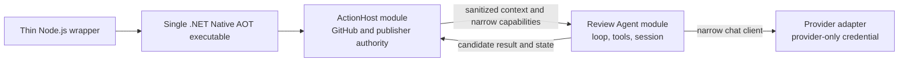

# Architecture Direction

The selected target architecture is a narrow, GitHub-first code review agent implemented primarily in C#:

1. a thin Node.js GitHub Action wrapper;
2. one Native AOT C# executable with a trusted `ActionHost`, an in-process review `Agent`, bounded tools, and provider adapters;
3. explicit data and capability boundaries that prevent GitHub credentials from entering provider-visible, model-visible, or durable channels;
4. an optional future worker process only when fault, resource, extension, or trust evidence justifies it.

The detailed decision, rationale, migration sequence, tools, `Microsoft.Extensions.AI` policy, versioning rules, and validation gates are defined in [`agent-runtime-rebaseline.md`](./agent-runtime-rebaseline.md).

## Status

This is the selected target direction. R1 removed the TypeScript business host and Claude Code CLI path, leaving no public Action. The current tree retains deterministic and ledger-oriented C# paths plus narrow M1-M4 TypeScript contract, state, publisher, and migration evidence until their R2-R4 owners replace them.

New work must distinguish:

- **current compatibility work**: a narrow fix required to keep the existing branch safe until removal;
- **migration work**: code that moves ownership toward the selected target and has an explicit deletion gate;
- **target work**: code that belongs in the thin wrapper or the C# Host, Agent, tools, provider, state, and publisher modules after migration.

Do not expand a current compatibility surface merely because it already exists.

## Architecture Decision And Rationale

The project keeps C# and Native AOT as runtime and distribution commitments, but no longer treats a broad TypeScript/C# protocol boundary as an engineering goal.

The prior split proved:

- deterministic process invocation;
- Native AOT feasibility;
- schema and fixture discipline;
- durable state selection and acceptance;
- strict provider parsing;
- canonical prefix materialization;
- fail-closed side-effect barriers.

It also created substantial duplicate business logic and validation across TypeScript and C#. The next product risk is not whether another sidecar can be validated in two languages. It is whether a bounded, stateful agent can use repository tools to produce better grounded reviews across workflow runs.

The architecture therefore optimizes for:

- one business implementation language;
- a real agent vertical slice before further broad contract work;
- explicit credential data-flow and capability isolation;
- deterministic host-owned publication;
- simple pre-1.0 compatibility rules;
- reusable safety invariants without preserving unnecessary source-language duplication.

## Target Runtime Boundary

The model cannot inspect process memory. It observes only provider requests and tool results deliberately sent to it. For the initial trusted, project-owned tool set, security therefore depends on explicit data flow, narrow capabilities, separate credential-bearing clients, and canary tests—not on a mandatory Host/Agent process split.

Separate `csproj` files can enforce dependency direction but are not a security boundary. A future same-binary worker mode may add kill and resource isolation, but a second process is not a complete sandbox by itself.

## Thin Node.js Wrapper Responsibilities

The wrapper may own:

- Action input and output bridging;
- secret masking;
- .NET payload resolution and checksum verification;
- cancellation forwarding;
- official JavaScript artifact toolkit integration;
- step annotations and summary forwarding;
- final exit-code forwarding.

It must not own GitHub business operations, prompts, provider selection semantics, tools, findings, session compatibility, prefix construction, or publisher policy.

## .NET ActionHost Responsibilities

The trusted host owns:

- GitHub event and input interpretation;
- PR metadata, changed-file, diff, and tracked-file snapshots;
- GitHub REST reads and writes;
- state selection, provenance, acceptance, and stale-writer protection;
- in-process Agent invocation through a narrow typed request;
- candidate result and state validation;
- finding fingerprints, duplicate suppression, line mapping, and caps;
- sticky and inline publication;
- the final side-effect and stale-head barrier.

The Host may receive GitHub and Actions service credentials. The Agent may not receive those credentials or credential-bearing objects.

## .NET Review Agent Responsibilities

The Agent owns:

- a narrow chat-client capability whose credential remains encapsulated by the provider adapter;
- a project-owned bounded agent loop;
- stable instructions, policy, and tool declarations;
- read-only repository tool validation and execution;
- canonical logical session messages;
- stable-prefix and dynamic-suffix classification;
- a provider-neutral logical request plan and logical prefix identity;
- model, tool, byte, token, and time budgets;
- structured proposed findings and evidence references;
- candidate session state and sanitized telemetry.

The Agent orchestration never receives `ActionConfig`, `HostSecrets`, a GitHub or Actions client or credential, an environment abstraction, a generic `HttpClient`, `IServiceProvider`, or a shell/process capability. It never owns GitHub writes, artifact publication, repository mutation, arbitrary shell execution, or untrusted build/test execution in the R2 spike or R3 initial live profile.

The provider adapter owns provider-specific role/message/block/tool projection from the logical request plan, the provider request envelope and wire serialization, continuation placement, any provider-specific cache-relevant projection or identity, HTTP transport, usage mapping, and provider-error mapping. It owns a separate provider-specific `HttpClient`, handler, endpoint allowlist, redirect policy, and authorization header. It does not share handlers or default headers with the GitHub client.

## Agent Tools

R2 proves the minimal Agent-loop subset:

- `read_file`;
- `search_text`;
- terminal `finish_review`.

The initial live Agent tool set completed in R3 retains that subset and adds:

- `list_changed_files`;
- `read_diff`;
- `list_files`;

Tools are implemented and enforced in C#. The model cannot construct commands or access files outside the reviewed tracked-file allowlist. Symbol analysis, test execution, shell, network access, MCP, and write tools remain deferred.

## Microsoft.Extensions.AI

R2 compares a pinned `Microsoft.Extensions.AI.Abstractions` dependency with project-minimal in-memory exchange types and selects the smaller option that passes the same Native AOT tool-loop proof. If adopted, `Microsoft.Extensions.AI.Abstractions` may provide `IChatClient` and chat/tool exchange types. It never owns:

- the durable ledger;
- the agent loop;
- tool dispatch and ordering;
- budgets;
- provider capabilities;
- checkpoint and commit semantics;
- prefix identity;
- terminal result validation.

The initial production loop invokes the selected narrow chat-client abstraction directly and handles function-call content itself. It uses explicit tool schemas, explicit dispatch, project-owned DTOs, and source-generated JSON metadata. `FunctionInvokingChatClient`, reflection-driven tool schema generation, Microsoft Agent Framework, and Semantic Kernel are not part of the initial target.

## Runtime Replacement

The project-owned runtime is the only live runtime direction for the new development head.

The Claude Code CLI path has been removed rather than maintained as a fallback. Historical tags preserve historical behavior. The first release after removal is breaking and safely bootstraps instead of migrating Claude session state.

New public runtime configuration should describe provider and review behavior directly. It should not preserve the migration-only combination of:

- `runtime_backend=legacy|deterministic-csharp|ledger-csharp`;
- `runtime_provider=test|claude-code-cli`;
- a second `live_provider` selector.

Deterministic and fake providers remain internal CI and fixture infrastructure.

## Session Continuity

R2 and R3 first prove completed-review continuation across two fresh executable invocations using persisted state. R4 then proves the product guarantee across two independent GitHub Actions runs, including state bootstrap/select, continuation, acceptance, stale-writer protection, and deterministic publication. Mid-run crash recovery is deferred.

The project-owned session ledger must contain enough canonical logical history to continue:

- stable instruction, policy, tool, provider, model, and adapter identities;
- admitted review-context and assistant messages;
- validated tool calls and complete bounded tool results;
- terminal review results;
- bounded provider continuation state required to replay thinking-enabled history;
- repository, pull request, and reviewed commit identity;
- predecessor and integrity evidence.

The durable model has two layers:

- project-owned canonical logical records for bounded user/assistant-visible content, repository tool calls/results, and terminal outcomes;
- a separate provider-scoped continuation envelope whose opaque byte/string payloads remain value-exact and whose structured items preserve validated fields, array order, association, and adapter-required placement.

Provider-owned artifacts are not normalized, interpreted, synthesized, or reused across providers. This restriction does not prevent canonical project-owned logical records.

The ledger does not persist credentials, raw HTTP bodies, headers, unrelated provider fields, unrestricted provider captures, transport framing, unbounded source content, private runner paths, or debug captures. Provider-returned reasoning text, signatures, signed blocks, or encrypted reasoning may be retained only as validated, bounded continuation records required or recommended for adapter-defined replay. The project does not request, reconstruct, or infer hidden chain-of-thought.

A content hash alone is not sufficient when the corresponding logical tool result cannot be reconstructed byte-for-byte. The first implementation persists the exact bounded tool result used in the conversation.

Restricted session state is never repository-visible plaintext. Reasoning, repository tool results, and provider continuation material must not enter Git objects, repository-visible state refs, caches, or normal public artifacts. A transport that cannot provide sufficient confidentiality requires workflow-authorized Host-side encryption whose key is not stored with the payload; otherwise readable continuation content is not persisted.

Encrypted state provides authenticated confidentiality or equivalent independent integrity protection. Authentication binds the current-format discriminator, Host-authoritative state identity, provider/adapter scope, session identity, and required generation/provenance. The key or key identifier is not payload authority. Authentication, identity, replay, or decryption failure is handled before state content reaches the Agent or provider. R2 defines the storage conformance contract; R4 proves that the production transport prevents fork and untrusted workflows from enumerating, restoring, overwriting, decrypting, deleting, or publishing restricted state.

## Trusted Policy Source

Stable configuration and review instructions are resolved at an immutable Host-selected workflow-authorized commit SHA, normally from the repository default-branch lineage. They are never loaded from the reviewed-head checkout, model-controlled input, ambient workspace, or an unverified mutable ref.

The selected policy bytes and trusted source identity participate in the session and cache identity.

## Provider Request Prefix

Stable prefix reconstruction remains a product constraint.

The stable prefix includes stable instructions, policy, ordered tool declarations, canonical completed prior session messages, prior tool calls and bounded results, provider-required reasoning continuation records, and provider/model/adapter identity.

The dynamic suffix includes the current PR delta, current-run tool activity, run identity, timestamps, request ids, and transient diagnostics.

The Agent/core owns the canonical logical records, stable-prefix and dynamic-suffix classification, provider-neutral logical request plan, and logical prefix identity. The provider adapter owns deterministic provider-specific role/message/block/tool projection, continuation placement, request-envelope and wire serialization, and any provider-specific cache-relevant projection or identity. Neither the selected narrow chat-client abstraction nor a provider SDK may silently reorder or rewrite that cache-relevant projection.

Existing M4 prefix and ledger contracts remain evidence for canonicalization, invalidation, and adversarial validation. They are not automatically the final agent-session wire format.

## Versioning

Explicit version or identity remains necessary for:

- Action and independently selected payload releases;
- durable cross-run state;
- replay and evaluation bundles.

Semantic session reuse uses canonical content digests for instructions, policy, ordered tools, and cache-relevant configuration, plus resolved provider/model and runtime build identity. It does not require duplicate manual version and id fields for the same content.

Internal C# types and atomically released components do not need public `V1`/`V2` families.

Before 1.0, new Agent state uses its own namespace and one current-format discriminator. Automatic selection never interprets old M4 bytes as current state; a non-current namespace or discriminator produces an observable bootstrap through a small generic header check, while an explicitly supplied incompatible artifact fails closed. The project does not maintain a full legacy reader, parallel writer, converter, or compatibility matrix without a real downstream need.

## Native AOT

Native AOT remains the production distribution target for the .NET payload.

Every new provider, AI abstraction, serializer, tool, and host dependency must:

- pass framework-dependent tests;
- publish successfully for the selected Native AOT target;
- execute a representative published-binary path;
- preserve reflection-disabled serialization;
- avoid introducing unreviewed trimming or AOT failures.

Compilation alone is not sufficient evidence.

## Security Invariants

- The model never receives a GitHub or provider credential.
- Agent orchestration receives no GitHub or Actions credential-bearing object or client, credential-bearing Host configuration, environment abstraction, generic HTTP client, service locator, or process capability.
- The provider credential remains inside the narrow provider transport and may appear only in its intended authorization channel.
- GitHub or Actions credential bytes never enter provider requests, tool results, durable state, normal diagnostics, outputs, summaries, or comments.
- The model has no GitHub write tool.
- The Agent has no repository write tool.
- All model-produced tool arguments and terminal findings are untrusted and validated.
- Repository, pull-request, diff, file, search-result, and tool-result content always remains untrusted data; persistence, restoration, and provider materialization cannot promote it into a system, developer, policy, tool-definition, provider-configuration, endpoint-selection, secret-channel, or other control record.
- Authenticated session structure binds logical record kind, provider-facing role or framing, tool-call association, and control/data classification; inconsistent restored records are rejected before Agent or provider admission.
- All GitHub side effects are deterministic and host-owned.
- The host rechecks the reviewed head before publication and state acceptance.
- State artifacts are bounded, integrity-bound, access-controlled, and free of credentials and unrestricted raw transport data. Among retained, logged, diagnostic, artifact, and published channels, reasoning continuation payloads are allowed only in restricted session state and never in normal traces or published surfaces; validated in-memory state and the outbound provider request required for replay may contain them transiently.
- Restricted state cannot become repository-visible plaintext; authenticated binding rejects tampering, cross-scope substitution, and stale replay before Agent/provider admission.
- R4 production authorization rejection occurs before decryption, provider construction, provider network activity, or publication, and fork/untrusted workflows cannot enumerate, restore, overwrite, decrypt, delete, or publish restricted state.
- A state-encryption key or key identifier is not payload authority; the key remains Host-only and is never stored with the payload or exposed to Agent/model/provider-visible channels.

See [`security-boundary.md`](./security-boundary.md) for the full boundary.

## Non-Goals

Do not build these in the first post-rebaseline architecture:

- a general coding or editing agent;
- arbitrary shell execution;
- model-callable GitHub writes;
- untrusted build or test execution;
- a hosted GitHub App;
- GitLab or Azure DevOps support;
- Microsoft Agent Framework or Semantic Kernel;
- deep Roslyn/MSBuild integration;
- dynamic provider/plugin discovery;
- dynamic latest-runtime downloads;
- provider-neutral normalization or human-visible publication of reasoning state;
- mid-run checkpoint recovery;
- a mandatory Host/Agent process split before an isolation need is demonstrated.
